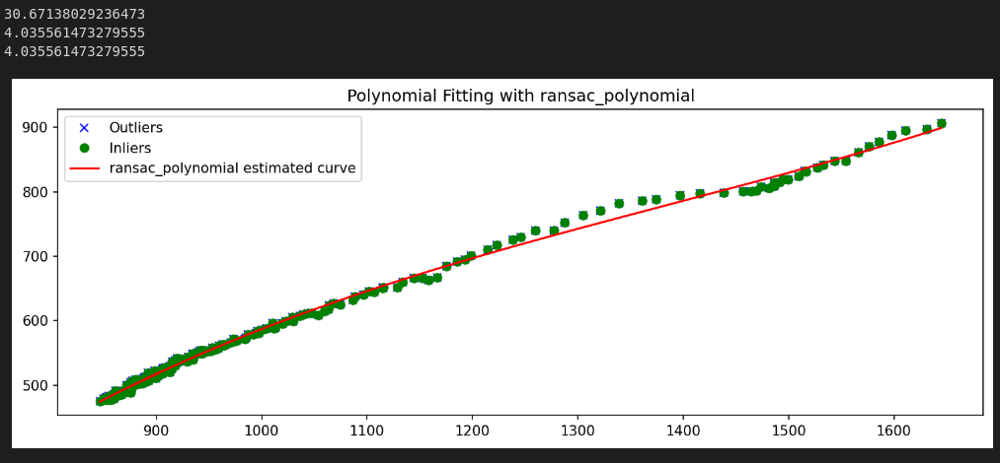

<h3 align="center">Object Tracking Utilities</h3>


<p align="center">Repository provide code to check the accuracy of a tracking algorithm.  
    <br> 
</p>

## 📝 Table of Contents

- [📝 Table of Contents](#-table-of-contents)
- [🧐 About ](#-about-)
- [🏁 Getting Started ](#-getting-started-)
- [🎈 Usage ](#-usage-)
- [🎉 Results](#-results)
- [✍️ Authors ](#️-authors-)

## 🧐 About <a name = "about"></a>

The code in this repository estimates the accuracy of real time tracking algorithm using polynomial fitting. The code fits the polynomial on the real time tracking data and calculates how near the tracking positions are on this polynomial. Closer tracking positions to the polynomial mean the tracking is more accurate.


## 🏁 Getting Started <a name = "getting_started"></a>

To run this code numpy, scikit-learn and matplotlib should be installed. To install these run the following commands on your terminal.

```bash
pip install -r requirements.txt
```


## 🎈 Usage <a name="usage"></a>

To use the code you should have the rectangle coordinates of the tracking positions. Rectangle coordinates should be in this form **x1,y1,w,h**, where (x1,y1) is the position of top left corner of the rectangle and w,h represent widht and height respectively.
1. Import the TrackingEvaluator Class
```python
from utils.tracking_evaluator import TrackingEvaluator
```
2. Defination

```python
"""
:param fitter_type: ransac, ransac_polynomial, ransac_gaussian, polynomial 
:param poly_degree: degree of the polynomial
:param data: numpy array with four columns x1,y1,w,h here x1,y1 represent top left corner w and h represent width and height
:param tracking_pos: top_left, top_right, bottom_left, bottom_right, center
"""

evaluator = TrackingEvaluator(data,fitter_type="ransac_polynomial",tracking_pos="center")

```

3. Training and Prediction

```python
evaluator.fit()
evaluator.predict()
```

4. Visualize the Fitting

```python
evaluator.visualize()
```

5. Check the error value
```python
""":param err_type: mse, mae, custom"""
print(evaluator.calc_error("mse"))
```

Look at test.ipynb for to check the implementation.


## 🎉 Results

Following code gives this type of result

```python
evaluator = TrackingEvaluator(data)
evaluator.fit()
evaluator.predict()
print(evaluator.calc_error("mse"))
print(evaluator.calc_error("mae"))
print(evaluator.calc_error("custom"))
evaluator.visualize()
```



## ✍️ Authors <a name = "authors"></a>

- [@UsamaImdad](https://github.com/UsamaImdadSian)
